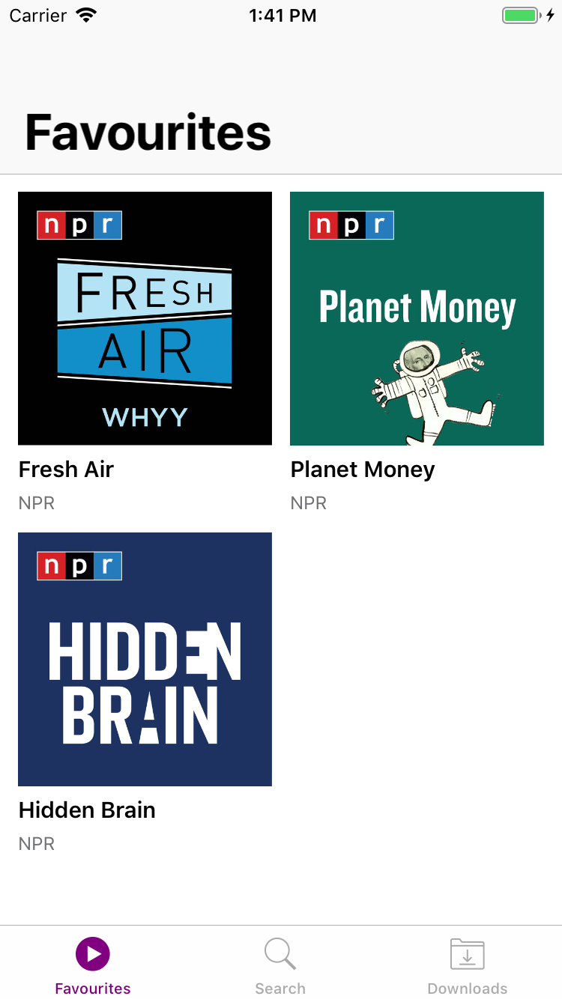
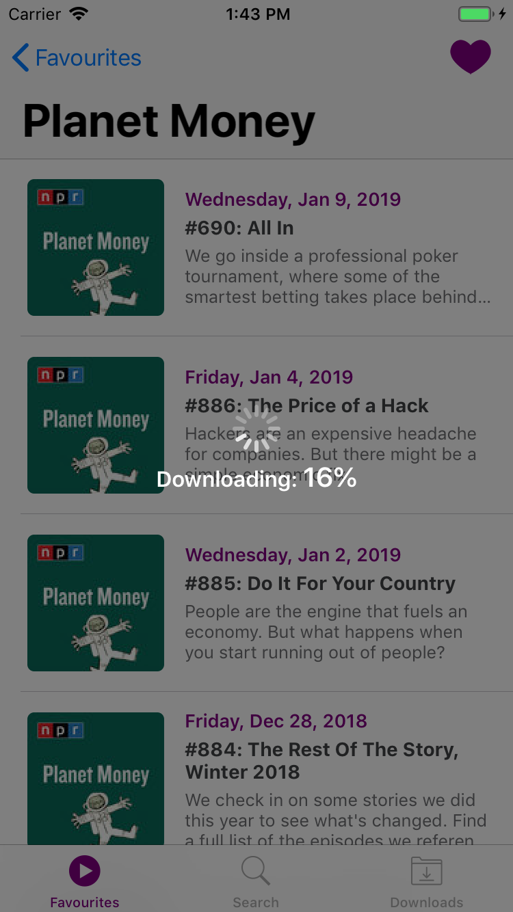
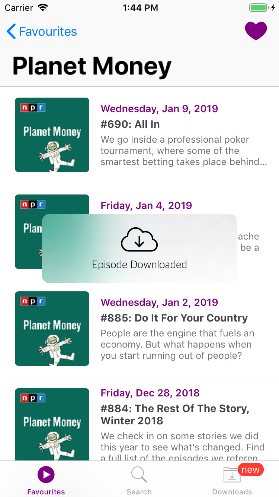
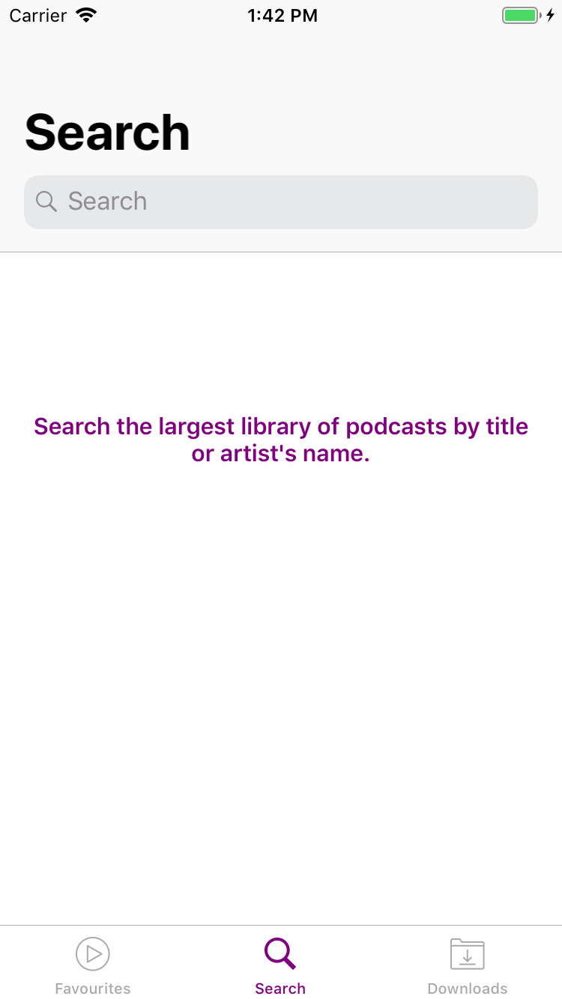
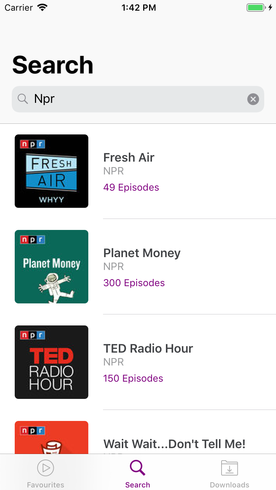
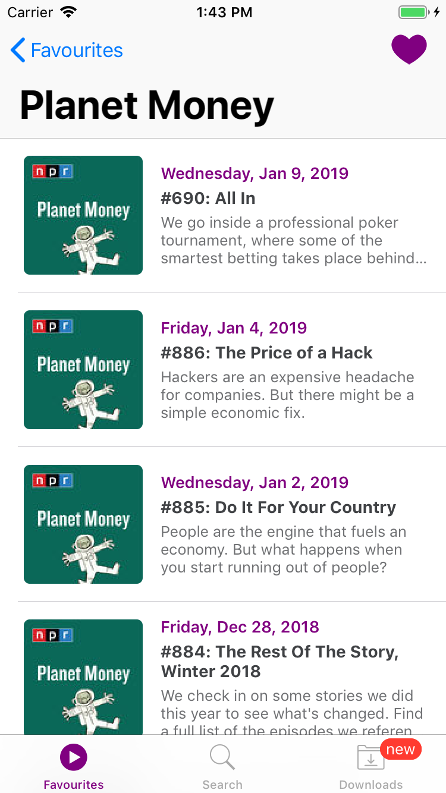
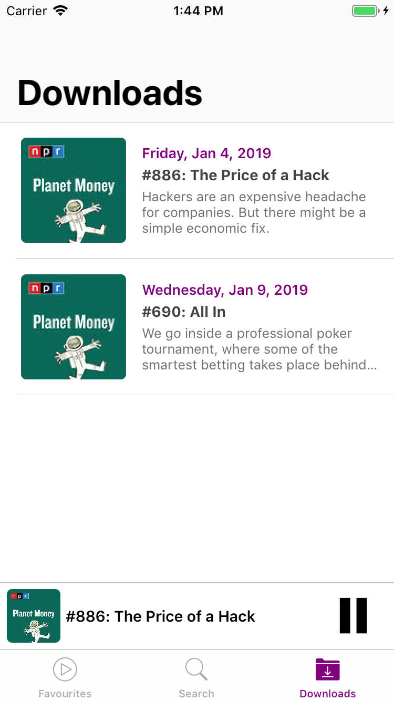

# Podcasts
[![Swift Version][swift-image]][swift-url]

An iOS app to browse and stream podcasts on our device.

## In Action
<kbd></kbd>

## UI

#### Favourites
<kbd></kbd>

#### Downloads
<kbd></kbd>&nbsp;&nbsp;&nbsp;&nbsp;<kbd></kbd>&nbsp;&nbsp;&nbsp;&nbsp;<kbd></kbd>

#### Search
<kbd></kbd>&nbsp;&nbsp;&nbsp;&nbsp;<kbd></kbd>

#### Podcast Episodes
<kbd></kbd>

#### Player
<kbd></kbd>&nbsp;&nbsp;&nbsp;&nbsp;<kbd></kbd>

## Features

- [x] Searching through podcasts by title or artist name.
- [x] Favouriting podcasts for easy access.
- [x] Downloading podcasts for offline playback.
- [x] Background Audio (app continues to play podcasts even if minimized or screen locked).
- [x] Media Player for Lock Screen.
- [x] Data persistance. 
- [x] Tab Bar Badges. 
- [x] Custom Acion Sheet.
- [x] Confirmation messages.

## Requirements
- iOS 10.0+
- Xcode 10
- Swift 4.2
- iTunes API

## Modules/Integrations Used
- Alamofire to fetch data from the iTunes

## Meta

Raghav Bhasin – [@bhasin97](https://github.com/raghavbhasin97) – raghavbhasin97@gmail.com

[swift-image]:https://img.shields.io/badge/swift-4.2-orange.svg
[swift-url]: https://swift.org/
